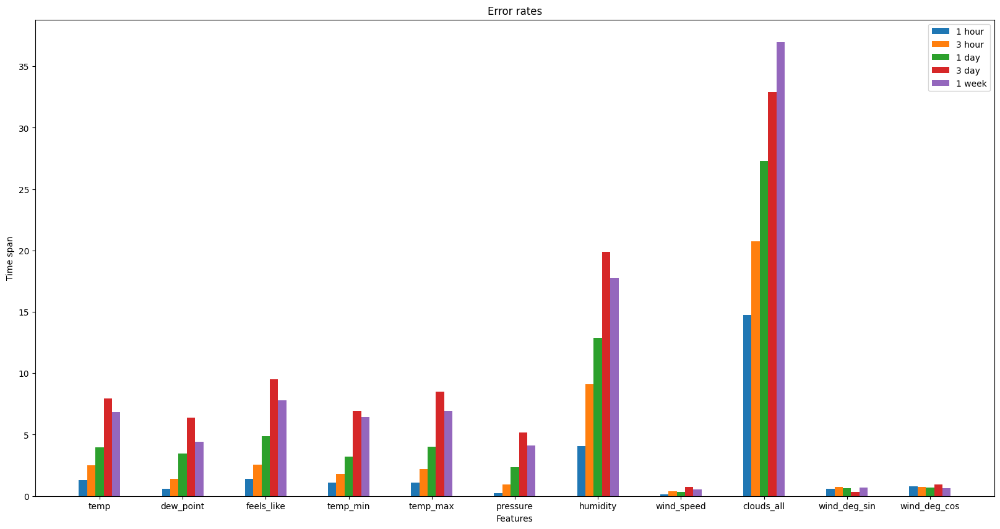
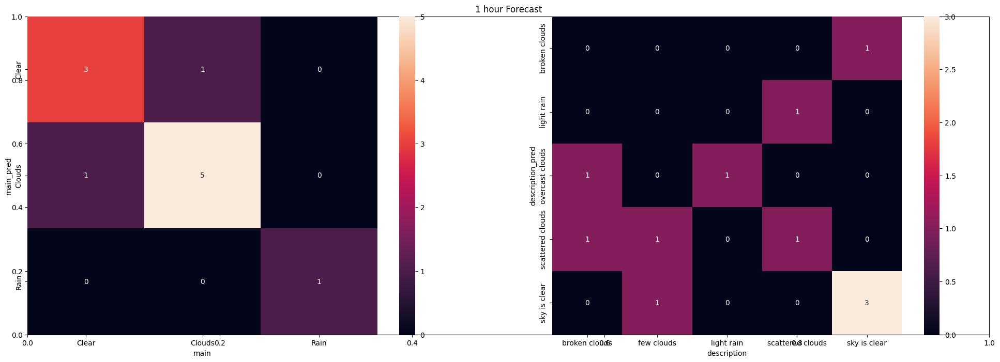
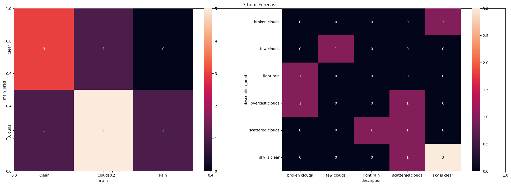
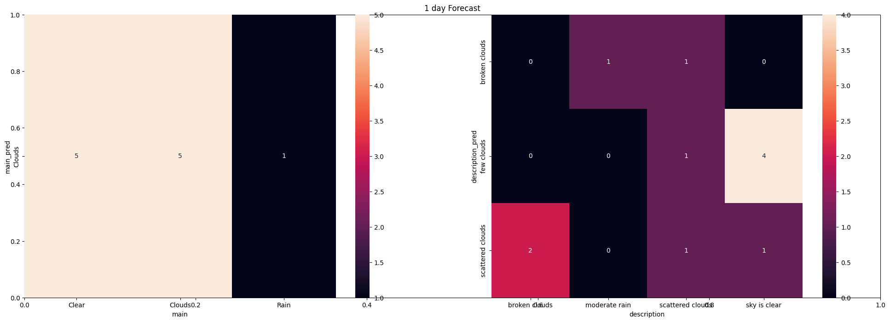
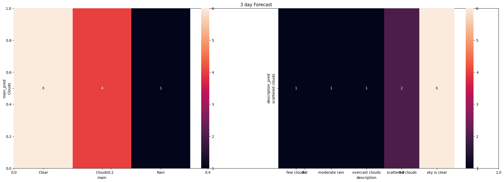
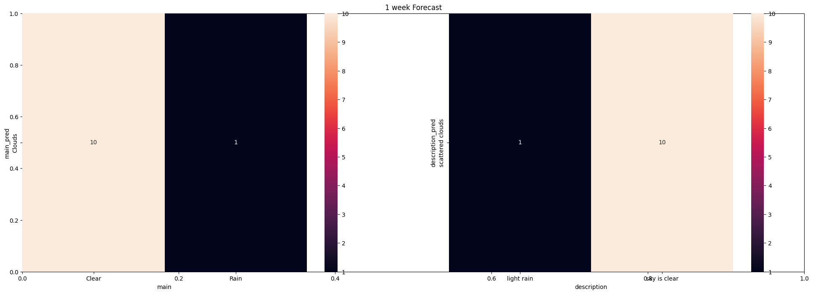

# Init


```python
import numpy as np
import pandas as pd
import seaborn as sns
from datetime import datetime

from statsmodels.tsa.vector_ar.var_model import VAR
from xgboost import XGBClassifier, DMatrix
from sklearn.model_selection import train_test_split
from sklearn.preprocessing import LabelEncoder

import matplotlib.pyplot as plt

from math import sqrt

import warnings

warnings.filterwarnings('ignore')
```


```python
data_path = 'data.csv'

df = pd.read_csv(data_path)
```

# Inspect Data


```python
df.head()
```


<div>
<style scoped>
    .dataframe tbody tr th:only-of-type {
        vertical-align: middle;
    }

    .dataframe tbody tr th {
        vertical-align: top;
    }

    .dataframe thead th {
        text-align: right;
    }
</style>
<table border="1" class="dataframe">
  <thead>
    <tr style="text-align: right;">
      <th></th>
      <th>dt</th>
      <th>dt_iso</th>
      <th>timezone</th>
      <th>city_name</th>
      <th>lat</th>
      <th>lon</th>
      <th>temp</th>
      <th>visibility</th>
      <th>dew_point</th>
      <th>feels_like</th>
      <th>...</th>
      <th>wind_gust</th>
      <th>rain_1h</th>
      <th>rain_3h</th>
      <th>snow_1h</th>
      <th>snow_3h</th>
      <th>clouds_all</th>
      <th>weather_id</th>
      <th>weather_main</th>
      <th>weather_description</th>
      <th>weather_icon</th>
    </tr>
  </thead>
  <tbody>
    <tr>
      <th>0</th>
      <td>283996800</td>
      <td>1979-01-01 00:00:00 +0000 UTC</td>
      <td>10800</td>
      <td>Nazilli</td>
      <td>37.909777</td>
      <td>28.324294</td>
      <td>16.70</td>
      <td>NaN</td>
      <td>13.80</td>
      <td>16.59</td>
      <td>...</td>
      <td>NaN</td>
      <td>NaN</td>
      <td>NaN</td>
      <td>NaN</td>
      <td>NaN</td>
      <td>67</td>
      <td>803</td>
      <td>Clouds</td>
      <td>broken clouds</td>
      <td>04n</td>
    </tr>
    <tr>
      <th>1</th>
      <td>284000400</td>
      <td>1979-01-01 01:00:00 +0000 UTC</td>
      <td>10800</td>
      <td>Nazilli</td>
      <td>37.909777</td>
      <td>28.324294</td>
      <td>16.68</td>
      <td>NaN</td>
      <td>14.15</td>
      <td>16.62</td>
      <td>...</td>
      <td>NaN</td>
      <td>NaN</td>
      <td>NaN</td>
      <td>NaN</td>
      <td>NaN</td>
      <td>85</td>
      <td>804</td>
      <td>Clouds</td>
      <td>overcast clouds</td>
      <td>04n</td>
    </tr>
    <tr>
      <th>2</th>
      <td>284004000</td>
      <td>1979-01-01 02:00:00 +0000 UTC</td>
      <td>10800</td>
      <td>Nazilli</td>
      <td>37.909777</td>
      <td>28.324294</td>
      <td>16.35</td>
      <td>NaN</td>
      <td>14.00</td>
      <td>16.29</td>
      <td>...</td>
      <td>NaN</td>
      <td>NaN</td>
      <td>NaN</td>
      <td>NaN</td>
      <td>NaN</td>
      <td>75</td>
      <td>803</td>
      <td>Clouds</td>
      <td>broken clouds</td>
      <td>04n</td>
    </tr>
    <tr>
      <th>3</th>
      <td>284007600</td>
      <td>1979-01-01 03:00:00 +0000 UTC</td>
      <td>10800</td>
      <td>Nazilli</td>
      <td>37.909777</td>
      <td>28.324294</td>
      <td>17.35</td>
      <td>NaN</td>
      <td>15.17</td>
      <td>17.41</td>
      <td>...</td>
      <td>NaN</td>
      <td>NaN</td>
      <td>NaN</td>
      <td>NaN</td>
      <td>NaN</td>
      <td>99</td>
      <td>804</td>
      <td>Clouds</td>
      <td>overcast clouds</td>
      <td>04n</td>
    </tr>
    <tr>
      <th>4</th>
      <td>284011200</td>
      <td>1979-01-01 04:00:00 +0000 UTC</td>
      <td>10800</td>
      <td>Nazilli</td>
      <td>37.909777</td>
      <td>28.324294</td>
      <td>17.47</td>
      <td>NaN</td>
      <td>15.10</td>
      <td>17.52</td>
      <td>...</td>
      <td>NaN</td>
      <td>NaN</td>
      <td>NaN</td>
      <td>NaN</td>
      <td>NaN</td>
      <td>97</td>
      <td>804</td>
      <td>Clouds</td>
      <td>overcast clouds</td>
      <td>04n</td>
    </tr>
  </tbody>
</table>
<p>5 rows × 28 columns</p>
</div>


```python
df.info()
```

    <class 'pandas.core.frame.DataFrame'>
    RangeIndex: 385584 entries, 0 to 385583
    Data columns (total 28 columns):
     #   Column               Non-Null Count   Dtype  
    ---  ------               --------------   -----  
     0   dt                   385584 non-null  int64  
     1   dt_iso               385584 non-null  object 
     2   timezone             385584 non-null  int64  
     3   city_name            385584 non-null  object 
     4   lat                  385584 non-null  float64
     5   lon                  385584 non-null  float64
     6   temp                 385584 non-null  float64
     7   visibility           0 non-null       float64
     8   dew_point            385584 non-null  float64
     9   feels_like           385584 non-null  float64
     10  temp_min             385584 non-null  float64
     11  temp_max             385584 non-null  float64
     12  pressure             385584 non-null  int64  
     13  sea_level            0 non-null       float64
     14  grnd_level           0 non-null       float64
     15  humidity             385584 non-null  int64  
     16  wind_speed           385584 non-null  float64
     17  wind_deg             385584 non-null  int64  
     18  wind_gust            360 non-null     float64
     19  rain_1h              36203 non-null   float64
     20  rain_3h              32 non-null      float64
     21  snow_1h              0 non-null       float64
     22  snow_3h              0 non-null       float64
     23  clouds_all           385584 non-null  int64  
     24  weather_id           385584 non-null  int64  
     25  weather_main         385584 non-null  object 
     26  weather_description  385584 non-null  object 
     27  weather_icon         385584 non-null  object 
    dtypes: float64(16), int64(7), object(5)
    memory usage: 82.4+ MB


# Remove unnecessary columns

## Drop mostly NaN columns

Since I got the data from OpenWeather, all the features are already clean and mostly non null.

The columns that contain null are mostly null too.

So we will just drop them.


```python
df.dropna(axis=1, inplace=True)
```


```python
df.info()
```

    <class 'pandas.core.frame.DataFrame'>
    RangeIndex: 385584 entries, 0 to 385583
    Data columns (total 20 columns):
     #   Column               Non-Null Count   Dtype  
    ---  ------               --------------   -----  
     0   dt                   385584 non-null  int64  
     1   dt_iso               385584 non-null  object 
     2   timezone             385584 non-null  int64  
     3   city_name            385584 non-null  object 
     4   lat                  385584 non-null  float64
     5   lon                  385584 non-null  float64
     6   temp                 385584 non-null  float64
     7   dew_point            385584 non-null  float64
     8   feels_like           385584 non-null  float64
     9   temp_min             385584 non-null  float64
     10  temp_max             385584 non-null  float64
     11  pressure             385584 non-null  int64  
     12  humidity             385584 non-null  int64  
     13  wind_speed           385584 non-null  float64
     14  wind_deg             385584 non-null  int64  
     15  clouds_all           385584 non-null  int64  
     16  weather_id           385584 non-null  int64  
     17  weather_main         385584 non-null  object 
     18  weather_description  385584 non-null  object 
     19  weather_icon         385584 non-null  object 
    dtypes: float64(8), int64(7), object(5)
    memory usage: 58.8+ MB


## Drop duplicate or unnecessary columns

They don't contain any kind of valuable information, they're just there for representation of data. So we will drop them.


```python
df.drop(['weather_id', 'weather_icon'], axis=1, inplace=True)

```

These have little to no variation, so deleting them would be the best


```python
df.drop(['dt', 'timezone', 'city_name', 'lat', 'lon'], axis=1, inplace=True)
```

## Check for non-null seeming null values


```python
df.describe()
```


<div>
<style scoped>
    .dataframe tbody tr th:only-of-type {
        vertical-align: middle;
    }

    .dataframe tbody tr th {
        vertical-align: top;
    }

    .dataframe thead th {
        text-align: right;
    }
</style>
<table border="1" class="dataframe">
  <thead>
    <tr style="text-align: right;">
      <th></th>
      <th>temp</th>
      <th>dew_point</th>
      <th>feels_like</th>
      <th>temp_min</th>
      <th>temp_max</th>
      <th>pressure</th>
      <th>humidity</th>
      <th>wind_speed</th>
      <th>wind_deg</th>
      <th>clouds_all</th>
    </tr>
  </thead>
  <tbody>
    <tr>
      <th>count</th>
      <td>385584.000000</td>
      <td>385584.000000</td>
      <td>385584.000000</td>
      <td>385584.000000</td>
      <td>385584.000000</td>
      <td>385584.000000</td>
      <td>385584.000000</td>
      <td>385584.000000</td>
      <td>385584.000000</td>
      <td>385584.000000</td>
    </tr>
    <tr>
      <th>mean</th>
      <td>22.025581</td>
      <td>12.700493</td>
      <td>22.130577</td>
      <td>18.830493</td>
      <td>24.341804</td>
      <td>1013.772760</td>
      <td>59.494320</td>
      <td>1.467998</td>
      <td>156.185015</td>
      <td>32.234084</td>
    </tr>
    <tr>
      <th>std</th>
      <td>9.146576</td>
      <td>5.631505</td>
      <td>10.030034</td>
      <td>9.012102</td>
      <td>9.195284</td>
      <td>5.875017</td>
      <td>19.123836</td>
      <td>0.735305</td>
      <td>105.699043</td>
      <td>37.972288</td>
    </tr>
    <tr>
      <th>min</th>
      <td>-9.240000</td>
      <td>-14.930000</td>
      <td>-13.150000</td>
      <td>-14.470000</td>
      <td>-5.720000</td>
      <td>977.000000</td>
      <td>5.000000</td>
      <td>0.000000</td>
      <td>0.000000</td>
      <td>0.000000</td>
    </tr>
    <tr>
      <th>25%</th>
      <td>14.950000</td>
      <td>9.450000</td>
      <td>14.450000</td>
      <td>11.850000</td>
      <td>17.170000</td>
      <td>1010.000000</td>
      <td>44.000000</td>
      <td>0.960000</td>
      <td>70.000000</td>
      <td>0.000000</td>
    </tr>
    <tr>
      <th>50%</th>
      <td>21.530000</td>
      <td>13.230000</td>
      <td>21.380000</td>
      <td>18.320000</td>
      <td>23.900000</td>
      <td>1013.000000</td>
      <td>60.000000</td>
      <td>1.410000</td>
      <td>110.000000</td>
      <td>10.000000</td>
    </tr>
    <tr>
      <th>75%</th>
      <td>28.970000</td>
      <td>16.800000</td>
      <td>29.340000</td>
      <td>25.600000</td>
      <td>31.470000</td>
      <td>1018.000000</td>
      <td>76.000000</td>
      <td>1.850000</td>
      <td>266.000000</td>
      <td>68.000000</td>
    </tr>
    <tr>
      <th>max</th>
      <td>47.400000</td>
      <td>31.500000</td>
      <td>53.060000</td>
      <td>44.550000</td>
      <td>49.440000</td>
      <td>1037.000000</td>
      <td>100.000000</td>
      <td>6.730000</td>
      <td>360.000000</td>
      <td>100.000000</td>
    </tr>
  </tbody>
</table>
</div>


## Feature engineering

Properly handle timestamps


```python
def sanitize_iso(string):
    string = string.split(' ')
    return ' '.join(string[:2])

df['dt_iso'] = df['dt_iso'].apply(sanitize_iso)
df['dt_iso'] = df['dt_iso'].apply(datetime.fromisoformat)
df['dt_iso'] = pd.to_datetime(df['dt_iso'])

df.index = df['dt_iso']
df.drop('dt_iso', axis=1, inplace=True)
```


```python
df.head()
```


<div>
<style scoped>
    .dataframe tbody tr th:only-of-type {
        vertical-align: middle;
    }

    .dataframe tbody tr th {
        vertical-align: top;
    }

    .dataframe thead th {
        text-align: right;
    }
</style>
<table border="1" class="dataframe">
  <thead>
    <tr style="text-align: right;">
      <th></th>
      <th>temp</th>
      <th>dew_point</th>
      <th>feels_like</th>
      <th>temp_min</th>
      <th>temp_max</th>
      <th>pressure</th>
      <th>humidity</th>
      <th>wind_speed</th>
      <th>wind_deg</th>
      <th>clouds_all</th>
      <th>weather_main</th>
      <th>weather_description</th>
    </tr>
    <tr>
      <th>dt_iso</th>
      <th></th>
      <th></th>
      <th></th>
      <th></th>
      <th></th>
      <th></th>
      <th></th>
      <th></th>
      <th></th>
      <th></th>
      <th></th>
      <th></th>
    </tr>
  </thead>
  <tbody>
    <tr>
      <th>1979-01-01 00:00:00</th>
      <td>16.70</td>
      <td>13.80</td>
      <td>16.59</td>
      <td>14.47</td>
      <td>18.55</td>
      <td>1012</td>
      <td>83</td>
      <td>1.83</td>
      <td>163</td>
      <td>67</td>
      <td>Clouds</td>
      <td>broken clouds</td>
    </tr>
    <tr>
      <th>1979-01-01 01:00:00</th>
      <td>16.68</td>
      <td>14.15</td>
      <td>16.62</td>
      <td>14.47</td>
      <td>18.59</td>
      <td>1011</td>
      <td>85</td>
      <td>1.66</td>
      <td>157</td>
      <td>85</td>
      <td>Clouds</td>
      <td>overcast clouds</td>
    </tr>
    <tr>
      <th>1979-01-01 02:00:00</th>
      <td>16.35</td>
      <td>14.00</td>
      <td>16.29</td>
      <td>14.37</td>
      <td>18.15</td>
      <td>1012</td>
      <td>86</td>
      <td>1.89</td>
      <td>170</td>
      <td>75</td>
      <td>Clouds</td>
      <td>broken clouds</td>
    </tr>
    <tr>
      <th>1979-01-01 03:00:00</th>
      <td>17.35</td>
      <td>15.17</td>
      <td>17.41</td>
      <td>15.34</td>
      <td>19.09</td>
      <td>1011</td>
      <td>87</td>
      <td>1.74</td>
      <td>149</td>
      <td>99</td>
      <td>Clouds</td>
      <td>overcast clouds</td>
    </tr>
    <tr>
      <th>1979-01-01 04:00:00</th>
      <td>17.47</td>
      <td>15.10</td>
      <td>17.52</td>
      <td>15.21</td>
      <td>19.25</td>
      <td>1010</td>
      <td>86</td>
      <td>1.99</td>
      <td>143</td>
      <td>97</td>
      <td>Clouds</td>
      <td>overcast clouds</td>
    </tr>
  </tbody>
</table>
</div>


Properly handle wind_degree attribute since it is an interval.
1 degree and 359 degree are not that distant from each other. There are just 2 degrees between them.


```python
df['wind_deg_sin'] = np.sin(df['wind_deg'])
df['wind_deg_cos'] = np.cos(df['wind_deg'])

df.drop('wind_deg', axis=1, inplace=True)
```


```python
df.head()
```


<div>
<style scoped>
    .dataframe tbody tr th:only-of-type {
        vertical-align: middle;
    }

    .dataframe tbody tr th {
        vertical-align: top;
    }

    .dataframe thead th {
        text-align: right;
    }
</style>
<table border="1" class="dataframe">
  <thead>
    <tr style="text-align: right;">
      <th></th>
      <th>temp</th>
      <th>dew_point</th>
      <th>feels_like</th>
      <th>temp_min</th>
      <th>temp_max</th>
      <th>pressure</th>
      <th>humidity</th>
      <th>wind_speed</th>
      <th>clouds_all</th>
      <th>weather_main</th>
      <th>weather_description</th>
      <th>wind_deg_sin</th>
      <th>wind_deg_cos</th>
    </tr>
    <tr>
      <th>dt_iso</th>
      <th></th>
      <th></th>
      <th></th>
      <th></th>
      <th></th>
      <th></th>
      <th></th>
      <th></th>
      <th></th>
      <th></th>
      <th></th>
      <th></th>
      <th></th>
    </tr>
  </thead>
  <tbody>
    <tr>
      <th>1979-01-01 00:00:00</th>
      <td>16.70</td>
      <td>13.80</td>
      <td>16.59</td>
      <td>14.47</td>
      <td>18.55</td>
      <td>1012</td>
      <td>83</td>
      <td>1.83</td>
      <td>67</td>
      <td>Clouds</td>
      <td>broken clouds</td>
      <td>-0.354910</td>
      <td>0.934900</td>
    </tr>
    <tr>
      <th>1979-01-01 01:00:00</th>
      <td>16.68</td>
      <td>14.15</td>
      <td>16.62</td>
      <td>14.47</td>
      <td>18.59</td>
      <td>1011</td>
      <td>85</td>
      <td>1.66</td>
      <td>85</td>
      <td>Clouds</td>
      <td>overcast clouds</td>
      <td>-0.079549</td>
      <td>0.996831</td>
    </tr>
    <tr>
      <th>1979-01-01 02:00:00</th>
      <td>16.35</td>
      <td>14.00</td>
      <td>16.29</td>
      <td>14.37</td>
      <td>18.15</td>
      <td>1012</td>
      <td>86</td>
      <td>1.89</td>
      <td>75</td>
      <td>Clouds</td>
      <td>broken clouds</td>
      <td>0.346649</td>
      <td>0.937995</td>
    </tr>
    <tr>
      <th>1979-01-01 03:00:00</th>
      <td>17.35</td>
      <td>15.17</td>
      <td>17.41</td>
      <td>15.34</td>
      <td>19.09</td>
      <td>1011</td>
      <td>87</td>
      <td>1.74</td>
      <td>99</td>
      <td>Clouds</td>
      <td>overcast clouds</td>
      <td>-0.974649</td>
      <td>-0.223741</td>
    </tr>
    <tr>
      <th>1979-01-01 04:00:00</th>
      <td>17.47</td>
      <td>15.10</td>
      <td>17.52</td>
      <td>15.21</td>
      <td>19.25</td>
      <td>1010</td>
      <td>86</td>
      <td>1.99</td>
      <td>97</td>
      <td>Clouds</td>
      <td>overcast clouds</td>
      <td>-0.998345</td>
      <td>0.057503</td>
    </tr>
  </tbody>
</table>
</div>


# Save weather_description and weather_main for later and drop them too

We will train a XGBoost model to predict the description of our weather.


```python
train_percent = 0.8

def train_xgb(df, label):

    clean_df = df.drop(['weather_main', 'weather_description'], axis=1)

    classifier = XGBClassifier()

    X = clean_df
    y = df[label]

    X_train, _, y_train, _ = train_test_split(X, y, train_size=train_percent, shuffle=False)
    le = LabelEncoder()
    y_train = le.fit_transform(y_train)

    classifier = classifier.fit(X_train, y_train)
    return classifier, le

main_classifier, le_main = train_xgb(df, 'weather_main')
description_classifier, le_description = train_xgb(df, 'weather_description')


weather_main = df['weather_main']
weather_description = df['weather_description']

df.drop(['weather_main', 'weather_description'], axis=1, inplace=True)

```

# Time Series Analysis

In this section, we will first do a time series prediction (temperature, wind_speed etc.) to a given interval, and then use this prediction to predict another feature (weather description, like: 'heavy rain')

This may result in poor results since we're using a predicted feature to predict another one. But let's try to see what we can get or not.


```python
steps = [1, 3, 24, 24 * 3, 24 * 7]
step_names = ('1 hour', '3 hour', '1 day', '3 day', '1 week')
iterations = 10
step_size = 0.01

def squared_error(x, y):
    return (x - y) ** 2

errors = np.zeros((len(steps), len(df.columns)))
general_forecast = {
    "type": [],
    "main": [],
    "main_pred": [],
    "description": [],
    "description_pred": [],
}

for i in range(iterations + 1):
    train_index = int(train_percent * len(df))
    train = df[:train_index]

    for j, step in enumerate(steps):
        test = df[train_index : train_index + step]
        test = test.to_numpy()

        var = VAR(endog=train)
        var = var.fit()

        pred = var.forecast(var.endog, step)

        x = test
        x_pred = pred

        y_main = weather_main[train_index + step - 1]
        y_description = weather_description[train_index + step - 1]

        y_main_pred = main_classifier.predict(x_pred)
        y_description_pred = description_classifier.predict(x_pred)

        y_main_pred = le_main.inverse_transform(y_main_pred)[-1]
        y_description_pred = le_description.inverse_transform(y_description_pred)[-1]

        general_forecast['type'].append(step_names[j])
        general_forecast['main'].append(y_main)
        general_forecast['main_pred'].append(y_main_pred)
        general_forecast['description'].append(y_description)
        general_forecast['description_pred'].append(y_description_pred)

        for k, (column, feature, feature_pred) in enumerate(zip(tuple(df.columns), x[-1], x_pred[-1])):
            errors[j][k] += sqrt(squared_error(feature, feature_pred))

    train_percent += step_size

errors /= iterations

errors = pd.DataFrame(data=errors, index=step_names, columns=df.columns)
```

RMSE's of each feature based on their time interval

We can see that our model was pretty bad at predicting wind degrees and cloud ratios.

This might result in poor weather prediction, like having 'clouds' predicted while the actual weather is 'clear'.

Other than that, it was quite good in 1 hour and 3 hour interval.


```python
errors
```


<div>
<style scoped>
    .dataframe tbody tr th:only-of-type {
        vertical-align: middle;
    }

    .dataframe tbody tr th {
        vertical-align: top;
    }

    .dataframe thead th {
        text-align: right;
    }
</style>
<table border="1" class="dataframe">
  <thead>
    <tr style="text-align: right;">
      <th></th>
      <th>temp</th>
      <th>dew_point</th>
      <th>feels_like</th>
      <th>temp_min</th>
      <th>temp_max</th>
      <th>pressure</th>
      <th>humidity</th>
      <th>wind_speed</th>
      <th>clouds_all</th>
      <th>wind_deg_sin</th>
      <th>wind_deg_cos</th>
    </tr>
  </thead>
  <tbody>
    <tr>
      <th>1 hour</th>
      <td>1.267022</td>
      <td>0.604453</td>
      <td>1.383803</td>
      <td>1.099517</td>
      <td>1.102828</td>
      <td>0.247718</td>
      <td>4.078178</td>
      <td>0.129572</td>
      <td>14.748122</td>
      <td>0.584878</td>
      <td>0.785303</td>
    </tr>
    <tr>
      <th>3 hour</th>
      <td>2.520337</td>
      <td>1.379743</td>
      <td>2.571608</td>
      <td>1.804680</td>
      <td>2.211870</td>
      <td>0.943804</td>
      <td>9.105610</td>
      <td>0.391199</td>
      <td>20.763857</td>
      <td>0.737720</td>
      <td>0.730271</td>
    </tr>
    <tr>
      <th>1 day</th>
      <td>3.960240</td>
      <td>3.436053</td>
      <td>4.860912</td>
      <td>3.225771</td>
      <td>4.015811</td>
      <td>2.353749</td>
      <td>12.861578</td>
      <td>0.350027</td>
      <td>27.311697</td>
      <td>0.617626</td>
      <td>0.686207</td>
    </tr>
    <tr>
      <th>3 day</th>
      <td>7.951743</td>
      <td>6.393036</td>
      <td>9.481014</td>
      <td>6.948761</td>
      <td>8.487645</td>
      <td>5.157205</td>
      <td>19.868634</td>
      <td>0.735082</td>
      <td>32.884429</td>
      <td>0.324762</td>
      <td>0.960794</td>
    </tr>
    <tr>
      <th>1 week</th>
      <td>6.824141</td>
      <td>4.420727</td>
      <td>7.783321</td>
      <td>6.448758</td>
      <td>6.932624</td>
      <td>4.131047</td>
      <td>17.774501</td>
      <td>0.540027</td>
      <td>36.960313</td>
      <td>0.677559</td>
      <td>0.656575</td>
    </tr>
  </tbody>
</table>
</div>


Here we see that errors increase as the time interval we're predicting increases.
An interesting thing to note is, weekly error rate is lower than 3 day error rate in almost all features.
This might indicate that there can be a weather trend that repeats weekly.


```python
X = errors.columns
X_axis = np.arange(len(X))

plt.rcParams['figure.figsize'] = [20, 10]

plt.bar(X_axis - 0.2, errors.iloc[0], 0.1, label = '1 hour')
plt.bar(X_axis - 0.1, errors.iloc[1], 0.1, label = '3 hour')
plt.bar(X_axis - 0, errors.iloc[2], 0.1, label = '1 day')
plt.bar(X_axis + 0.1, errors.iloc[3], 0.1, label = '3 day')
plt.bar(X_axis + 0.2, errors.iloc[4], 0.1, label = '1 week')
  
plt.xticks(X_axis, X)
plt.xlabel('Features')
plt.ylabel('Time span')
plt.title('Error rates')

plt.legend()
plt.show()
```


    

    


```python
forecast_df = pd.DataFrame(general_forecast)
```

1 hour and 3 hour predictions turned out to be quite good. They do miss sometimes, yes. But they don't say heavy rain to clear skies.


```python
def plot_heatmap(forecast_type):
    contingency_matrix = pd.crosstab(forecast_df[forecast_df['type'] == forecast_type]['main'], forecast_df[forecast_df['type'] == forecast_type]['main_pred'])
    plt.clf()
    plt.title(f"{forecast_type} Forecast")
    fig = plt.gcf()
    fig.set_size_inches(24, 8)
    plt.subplot(121)
    sns.heatmap(contingency_matrix.T, annot=True)
    plt.subplot(122)
    contingency_matrix = pd.crosstab(forecast_df[forecast_df['type'] == forecast_type]['description'], forecast_df[forecast_df['type'] == forecast_type]['description_pred'])
    sns.heatmap(contingency_matrix.T, annot=True)
    plt.show()
```


```python
forecast_df[forecast_df['type'] == '1 hour']
```


<div>
<style scoped>
    .dataframe tbody tr th:only-of-type {
        vertical-align: middle;
    }

    .dataframe tbody tr th {
        vertical-align: top;
    }

    .dataframe thead th {
        text-align: right;
    }
</style>
<table border="1" class="dataframe">
  <thead>
    <tr style="text-align: right;">
      <th></th>
      <th>type</th>
      <th>main</th>
      <th>main_pred</th>
      <th>description</th>
      <th>description_pred</th>
    </tr>
  </thead>
  <tbody>
    <tr>
      <th>0</th>
      <td>1 hour</td>
      <td>Clouds</td>
      <td>Clouds</td>
      <td>scattered clouds</td>
      <td>light rain</td>
    </tr>
    <tr>
      <th>5</th>
      <td>1 hour</td>
      <td>Clouds</td>
      <td>Clouds</td>
      <td>few clouds</td>
      <td>scattered clouds</td>
    </tr>
    <tr>
      <th>10</th>
      <td>1 hour</td>
      <td>Clouds</td>
      <td>Clouds</td>
      <td>broken clouds</td>
      <td>overcast clouds</td>
    </tr>
    <tr>
      <th>15</th>
      <td>1 hour</td>
      <td>Clear</td>
      <td>Clear</td>
      <td>sky is clear</td>
      <td>sky is clear</td>
    </tr>
    <tr>
      <th>20</th>
      <td>1 hour</td>
      <td>Clear</td>
      <td>Clear</td>
      <td>sky is clear</td>
      <td>sky is clear</td>
    </tr>
    <tr>
      <th>25</th>
      <td>1 hour</td>
      <td>Clouds</td>
      <td>Clouds</td>
      <td>broken clouds</td>
      <td>scattered clouds</td>
    </tr>
    <tr>
      <th>30</th>
      <td>1 hour</td>
      <td>Clear</td>
      <td>Clouds</td>
      <td>sky is clear</td>
      <td>broken clouds</td>
    </tr>
    <tr>
      <th>35</th>
      <td>1 hour</td>
      <td>Clouds</td>
      <td>Clouds</td>
      <td>scattered clouds</td>
      <td>scattered clouds</td>
    </tr>
    <tr>
      <th>40</th>
      <td>1 hour</td>
      <td>Clear</td>
      <td>Clear</td>
      <td>sky is clear</td>
      <td>sky is clear</td>
    </tr>
    <tr>
      <th>45</th>
      <td>1 hour</td>
      <td>Rain</td>
      <td>Rain</td>
      <td>light rain</td>
      <td>overcast clouds</td>
    </tr>
    <tr>
      <th>50</th>
      <td>1 hour</td>
      <td>Clouds</td>
      <td>Clear</td>
      <td>few clouds</td>
      <td>sky is clear</td>
    </tr>
  </tbody>
</table>
</div>


```python
plot_heatmap('1 hour')
```


    

    


```python
forecast_df[forecast_df['type'] == '3 hour']
```


<div>
<style scoped>
    .dataframe tbody tr th:only-of-type {
        vertical-align: middle;
    }

    .dataframe tbody tr th {
        vertical-align: top;
    }

    .dataframe thead th {
        text-align: right;
    }
</style>
<table border="1" class="dataframe">
  <thead>
    <tr style="text-align: right;">
      <th></th>
      <th>type</th>
      <th>main</th>
      <th>main_pred</th>
      <th>description</th>
      <th>description_pred</th>
    </tr>
  </thead>
  <tbody>
    <tr>
      <th>1</th>
      <td>3 hour</td>
      <td>Clouds</td>
      <td>Clouds</td>
      <td>broken clouds</td>
      <td>light rain</td>
    </tr>
    <tr>
      <th>6</th>
      <td>3 hour</td>
      <td>Clouds</td>
      <td>Clouds</td>
      <td>few clouds</td>
      <td>few clouds</td>
    </tr>
    <tr>
      <th>11</th>
      <td>3 hour</td>
      <td>Clouds</td>
      <td>Clouds</td>
      <td>broken clouds</td>
      <td>overcast clouds</td>
    </tr>
    <tr>
      <th>16</th>
      <td>3 hour</td>
      <td>Clear</td>
      <td>Clear</td>
      <td>sky is clear</td>
      <td>sky is clear</td>
    </tr>
    <tr>
      <th>21</th>
      <td>3 hour</td>
      <td>Clear</td>
      <td>Clear</td>
      <td>sky is clear</td>
      <td>sky is clear</td>
    </tr>
    <tr>
      <th>26</th>
      <td>3 hour</td>
      <td>Rain</td>
      <td>Clouds</td>
      <td>light rain</td>
      <td>scattered clouds</td>
    </tr>
    <tr>
      <th>31</th>
      <td>3 hour</td>
      <td>Clear</td>
      <td>Clouds</td>
      <td>sky is clear</td>
      <td>broken clouds</td>
    </tr>
    <tr>
      <th>36</th>
      <td>3 hour</td>
      <td>Clouds</td>
      <td>Clouds</td>
      <td>scattered clouds</td>
      <td>scattered clouds</td>
    </tr>
    <tr>
      <th>41</th>
      <td>3 hour</td>
      <td>Clear</td>
      <td>Clear</td>
      <td>sky is clear</td>
      <td>sky is clear</td>
    </tr>
    <tr>
      <th>46</th>
      <td>3 hour</td>
      <td>Clouds</td>
      <td>Clouds</td>
      <td>scattered clouds</td>
      <td>overcast clouds</td>
    </tr>
    <tr>
      <th>51</th>
      <td>3 hour</td>
      <td>Clouds</td>
      <td>Clear</td>
      <td>scattered clouds</td>
      <td>sky is clear</td>
    </tr>
  </tbody>
</table>
</div>


```python
plot_heatmap('3 hour')
```


    

    


1 day forecasting is somewhere between. It's not good as hourly predictions but it's not bad as 3 day or weekly forecasts.


```python
forecast_df[forecast_df['type'] == '1 day']
```


<div>
<style scoped>
    .dataframe tbody tr th:only-of-type {
        vertical-align: middle;
    }

    .dataframe tbody tr th {
        vertical-align: top;
    }

    .dataframe thead th {
        text-align: right;
    }
</style>
<table border="1" class="dataframe">
  <thead>
    <tr style="text-align: right;">
      <th></th>
      <th>type</th>
      <th>main</th>
      <th>main_pred</th>
      <th>description</th>
      <th>description_pred</th>
    </tr>
  </thead>
  <tbody>
    <tr>
      <th>2</th>
      <td>1 day</td>
      <td>Clouds</td>
      <td>Clouds</td>
      <td>broken clouds</td>
      <td>scattered clouds</td>
    </tr>
    <tr>
      <th>7</th>
      <td>1 day</td>
      <td>Clear</td>
      <td>Clouds</td>
      <td>sky is clear</td>
      <td>few clouds</td>
    </tr>
    <tr>
      <th>12</th>
      <td>1 day</td>
      <td>Clouds</td>
      <td>Clouds</td>
      <td>scattered clouds</td>
      <td>broken clouds</td>
    </tr>
    <tr>
      <th>17</th>
      <td>1 day</td>
      <td>Clear</td>
      <td>Clouds</td>
      <td>sky is clear</td>
      <td>few clouds</td>
    </tr>
    <tr>
      <th>22</th>
      <td>1 day</td>
      <td>Clear</td>
      <td>Clouds</td>
      <td>sky is clear</td>
      <td>few clouds</td>
    </tr>
    <tr>
      <th>27</th>
      <td>1 day</td>
      <td>Clouds</td>
      <td>Clouds</td>
      <td>broken clouds</td>
      <td>scattered clouds</td>
    </tr>
    <tr>
      <th>32</th>
      <td>1 day</td>
      <td>Clear</td>
      <td>Clouds</td>
      <td>sky is clear</td>
      <td>scattered clouds</td>
    </tr>
    <tr>
      <th>37</th>
      <td>1 day</td>
      <td>Clouds</td>
      <td>Clouds</td>
      <td>scattered clouds</td>
      <td>scattered clouds</td>
    </tr>
    <tr>
      <th>42</th>
      <td>1 day</td>
      <td>Clear</td>
      <td>Clouds</td>
      <td>sky is clear</td>
      <td>few clouds</td>
    </tr>
    <tr>
      <th>47</th>
      <td>1 day</td>
      <td>Rain</td>
      <td>Clouds</td>
      <td>moderate rain</td>
      <td>broken clouds</td>
    </tr>
    <tr>
      <th>52</th>
      <td>1 day</td>
      <td>Clouds</td>
      <td>Clouds</td>
      <td>scattered clouds</td>
      <td>few clouds</td>
    </tr>
  </tbody>
</table>
</div>


```python
plot_heatmap('1 day')
```


    

    


1 week and 3 day forecast is not so efficient since we have some error with the prediction of features and we're using these biased features to predict a new feature. These errors cumulate in time.


```python
forecast_df[forecast_df['type'] == '3 day']
```


<div>
<style scoped>
    .dataframe tbody tr th:only-of-type {
        vertical-align: middle;
    }

    .dataframe tbody tr th {
        vertical-align: top;
    }

    .dataframe thead th {
        text-align: right;
    }
</style>
<table border="1" class="dataframe">
  <thead>
    <tr style="text-align: right;">
      <th></th>
      <th>type</th>
      <th>main</th>
      <th>main_pred</th>
      <th>description</th>
      <th>description_pred</th>
    </tr>
  </thead>
  <tbody>
    <tr>
      <th>3</th>
      <td>3 day</td>
      <td>Clear</td>
      <td>Clouds</td>
      <td>sky is clear</td>
      <td>scattered clouds</td>
    </tr>
    <tr>
      <th>8</th>
      <td>3 day</td>
      <td>Clear</td>
      <td>Clouds</td>
      <td>sky is clear</td>
      <td>scattered clouds</td>
    </tr>
    <tr>
      <th>13</th>
      <td>3 day</td>
      <td>Clouds</td>
      <td>Clouds</td>
      <td>overcast clouds</td>
      <td>scattered clouds</td>
    </tr>
    <tr>
      <th>18</th>
      <td>3 day</td>
      <td>Clouds</td>
      <td>Clouds</td>
      <td>few clouds</td>
      <td>scattered clouds</td>
    </tr>
    <tr>
      <th>23</th>
      <td>3 day</td>
      <td>Clouds</td>
      <td>Clouds</td>
      <td>scattered clouds</td>
      <td>scattered clouds</td>
    </tr>
    <tr>
      <th>28</th>
      <td>3 day</td>
      <td>Clouds</td>
      <td>Clouds</td>
      <td>scattered clouds</td>
      <td>scattered clouds</td>
    </tr>
    <tr>
      <th>33</th>
      <td>3 day</td>
      <td>Clear</td>
      <td>Clouds</td>
      <td>sky is clear</td>
      <td>scattered clouds</td>
    </tr>
    <tr>
      <th>38</th>
      <td>3 day</td>
      <td>Clear</td>
      <td>Clouds</td>
      <td>sky is clear</td>
      <td>scattered clouds</td>
    </tr>
    <tr>
      <th>43</th>
      <td>3 day</td>
      <td>Clear</td>
      <td>Clouds</td>
      <td>sky is clear</td>
      <td>scattered clouds</td>
    </tr>
    <tr>
      <th>48</th>
      <td>3 day</td>
      <td>Rain</td>
      <td>Clouds</td>
      <td>moderate rain</td>
      <td>scattered clouds</td>
    </tr>
    <tr>
      <th>53</th>
      <td>3 day</td>
      <td>Clear</td>
      <td>Clouds</td>
      <td>sky is clear</td>
      <td>scattered clouds</td>
    </tr>
  </tbody>
</table>
</div>


```python
plot_heatmap('3 day')
```


    

    


```python
forecast_df[forecast_df['type'] == '1 week']
```


<div>
<style scoped>
    .dataframe tbody tr th:only-of-type {
        vertical-align: middle;
    }

    .dataframe tbody tr th {
        vertical-align: top;
    }

    .dataframe thead th {
        text-align: right;
    }
</style>
<table border="1" class="dataframe">
  <thead>
    <tr style="text-align: right;">
      <th></th>
      <th>type</th>
      <th>main</th>
      <th>main_pred</th>
      <th>description</th>
      <th>description_pred</th>
    </tr>
  </thead>
  <tbody>
    <tr>
      <th>4</th>
      <td>1 week</td>
      <td>Clear</td>
      <td>Clouds</td>
      <td>sky is clear</td>
      <td>scattered clouds</td>
    </tr>
    <tr>
      <th>9</th>
      <td>1 week</td>
      <td>Clear</td>
      <td>Clouds</td>
      <td>sky is clear</td>
      <td>scattered clouds</td>
    </tr>
    <tr>
      <th>14</th>
      <td>1 week</td>
      <td>Clear</td>
      <td>Clouds</td>
      <td>sky is clear</td>
      <td>scattered clouds</td>
    </tr>
    <tr>
      <th>19</th>
      <td>1 week</td>
      <td>Clear</td>
      <td>Clouds</td>
      <td>sky is clear</td>
      <td>scattered clouds</td>
    </tr>
    <tr>
      <th>24</th>
      <td>1 week</td>
      <td>Clear</td>
      <td>Clouds</td>
      <td>sky is clear</td>
      <td>scattered clouds</td>
    </tr>
    <tr>
      <th>29</th>
      <td>1 week</td>
      <td>Clear</td>
      <td>Clouds</td>
      <td>sky is clear</td>
      <td>scattered clouds</td>
    </tr>
    <tr>
      <th>34</th>
      <td>1 week</td>
      <td>Clear</td>
      <td>Clouds</td>
      <td>sky is clear</td>
      <td>scattered clouds</td>
    </tr>
    <tr>
      <th>39</th>
      <td>1 week</td>
      <td>Clear</td>
      <td>Clouds</td>
      <td>sky is clear</td>
      <td>scattered clouds</td>
    </tr>
    <tr>
      <th>44</th>
      <td>1 week</td>
      <td>Clear</td>
      <td>Clouds</td>
      <td>sky is clear</td>
      <td>scattered clouds</td>
    </tr>
    <tr>
      <th>49</th>
      <td>1 week</td>
      <td>Rain</td>
      <td>Clouds</td>
      <td>light rain</td>
      <td>scattered clouds</td>
    </tr>
    <tr>
      <th>54</th>
      <td>1 week</td>
      <td>Clear</td>
      <td>Clouds</td>
      <td>sky is clear</td>
      <td>scattered clouds</td>
    </tr>
  </tbody>
</table>
</div>


```python
plot_heatmap('1 week')
```


    

    

